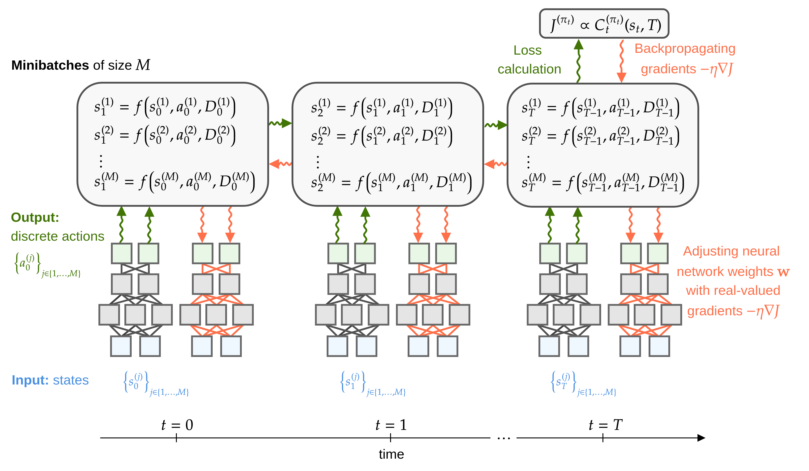

# Inventory Optimization

The directory `sourcing_models/` contains implementations of different dual sourcing heuristics (single index, dual index, capped-dual index, tailored-base surge). The files `sourcing_models/recursion_numba.py` and `sourcing_models/recursion_numba_state_output.py` provide dynamic program implementations with and without state output, respectively. We use the high-performance Python compiler Numba to speed-up the dynamic programming iterations.

Trained neural networks are provided in `sourcing_models/trained_neural_nets`. These files can be used in transfer-learning tasks.

Different neural-network controllers and inventory dynamics implementations (in pytorch) are stored in `neural_control/`.

An optimization example that uses real-world data is available in `MSOM_data/`. 

<div align="center">

</div>

The above figure shows a schematic of solving discrete-time stochastic control problems with recurrent neural networks.

### Parameters

| parameter | type    | description                                                   |
| --------- | ------- | --------------------------------------------------------------|
| `ce`      | int     | expedited order cost (per unit)                               |
| `cr`      | int     | regular order cost (per unit)                                 |
| `fe`      | int     | fixed expedited order cost (per unit)                         |
| `fr`      | int     | fixed regular order cost (per unit)                           |
| `h`       | int     | holding cost (per unit)                                       |
| `b`       | int     | shortage cost (per unit)                                      |
| `le`      | int     | expedited order lead time                                     |
| `lr`      | int     | regular order lead time                                       |
| `T`       | int     | number of simulation periods                                  |

## Reference
* L. Böttcher, T. Asikis, I. Fragkos, Solving Inventory Management Problems with Inventory-dynamics-informed Neural Networks, arXiv:2201.06126

```
@article{bottcher2022solving,
  title={Solving Inventory Management Problems with Inventory-dynamics-informed Neural Networks},
  author={B{\"o}ttcher, Lucas and Asikis, Thomas and Fragkos, Ioannis},
  journal={arXiv preprint arXiv:2201.06126},
  year={2022}
}
