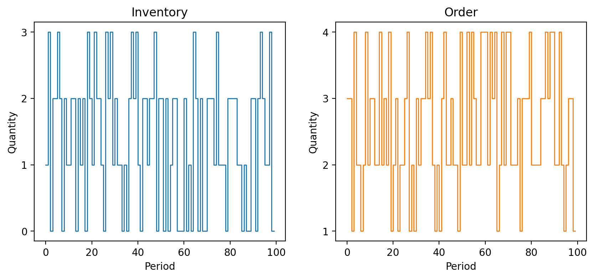

Plot Simulation Results
=======================

We can inspect how the controller performs in the specified sourcing environment by plotting the inventory and order histories.

.. code-block:: python

    # Simulate and plot the results
    single_controller.plot(sourcing_model=single_sourcing_model, sourcing_periods=100)

Then we can calculate optimal orders using the trained model.

.. code-block:: python
    # Calculate the optimal order quantity for applications
    single_controller.forward(current_inventory=10, past_orders=[1, 5])